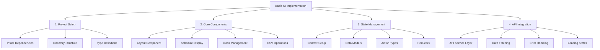

# Thunder Scheduler: Basic UI Implementation Plan

## Overview

This document outlines the implementation plan for Phase 1, Step 6: Basic UI Implementation of the Thunder Scheduler project. The plan covers core components development, state management implementation, and API integration over a 4-day timeline.



## 1. Project Setup

### Dependencies to Add
- `@tanstack/react-query`: For API data fetching and caching
- `axios`: For HTTP requests
- `@headlessui/react`: For accessible UI components
- `tailwindcss`: For styling
- `react-hot-toast`: For notifications
- `@heroicons/react`: For icons
- `zod`: For runtime type validation

### Directory Structure
```
frontend/src/
├── components/
│   ├── layout/
│   │   ├── Header.tsx
│   │   ├── Sidebar.tsx
│   │   └── Layout.tsx
│   ├── schedule/
│   │   ├── ScheduleDisplay.tsx
│   │   ├── ClassList.tsx
│   │   └── ConflictIndicator.tsx
│   └── shared/
│       ├── Button.tsx
│       ├── Card.tsx
│       └── LoadingSpinner.tsx
├── hooks/
│   ├── useSchedule.ts
│   ├── useClasses.ts
│   └── useCSV.ts
├── services/
│   ├── api.ts
│   └── csvService.ts
├── types/
│   ├── schedule.types.ts
│   └── class.types.ts
└── context/
    └── ScheduleContext.tsx
```

## 2. Core Components Implementation

### Layout Components
- Responsive header with navigation
- Sidebar for tools and options
- Main content area with proper spacing

### Schedule Display Component
- Grid-based layout for schedule visualization
- Color-coded class blocks
- Time period indicators
- Week/day navigation

### Class Management Interface
- List of available classes
- Class details display
- Conflict indicators
- Quick actions (edit, delete)

### CSV Operations Interface
- File upload zone
- Export options
- Validation feedback
- Progress indicators

## 3. State Management

### Context Structure
```typescript
interface ScheduleState {
  schedule: Schedule | null;
  classes: Class[];
  conflicts: Conflict[];
  status: {
    loading: boolean;
    error: Error | null;
    lastUpdate: Date | null;
  };
}

interface ScheduleActions {
  loadSchedule: () => Promise<void>;
  updateClass: (classId: string, updates: Partial<Class>) => Promise<void>;
  importCSV: (file: File) => Promise<void>;
  exportSchedule: () => Promise<void>;
}
```

### Data Flow
1. API calls through services layer
2. State updates through context
3. Component updates through hooks
4. Error handling through toast notifications

## 4. API Integration

### Service Layer
```typescript
class APIService {
  getSchedule(): Promise<Schedule>;
  getClasses(): Promise<Class[]>;
  updateClass(id: string, data: Partial<Class>): Promise<Class>;
  importCSV(file: File): Promise<ImportResult>;
  exportSchedule(): Promise<Blob>;
}
```

### Error Handling Strategy
- Toast notifications for user feedback
- Error boundaries for component-level errors
- Retry mechanisms for failed requests
- Graceful degradation of features

## Timeline Breakdown (4 days)

1. Day 1:
   - Project setup
   - Dependencies installation
   - Directory structure creation
   - Basic component scaffolding

2. Day 2:
   - Core components implementation
   - Basic styling setup
   - Layout structure

3. Day 3:
   - State management implementation
   - API service layer
   - Data fetching setup

4. Day 4:
   - Error handling
   - Loading states
   - Testing and refinement
   - Documentation

## Next Steps

After documenting this plan, we will proceed with:
1. Setting up the project dependencies
2. Creating the directory structure
3. Implementing core components
4. Adding state management and API integration