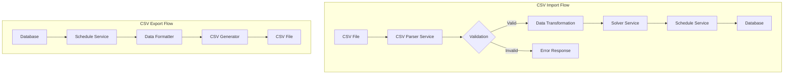

# CSV Import/Export Design Document

## Overview
This document outlines the design and implementation plan for the CSV Import/Export functionality in the Thunder Scheduler project. This feature allows users to import class conflict data from CSV files and export generated schedules back to CSV format.

## CSV Format Specification

### Import Format
1. Field Separator: comma (,)
2. Period Separator: semicolon (;)
3. Required Headers: "Class,Monday,Tuesday,Wednesday,Thursday,Friday"
4. Data Format:
   - Class Names: Non-empty strings
   - Periods: Semicolon-separated list of positive integers

Example:
```csv
Class,Monday,Tuesday,Wednesday,Thursday,Friday
Class 1A,1;2;3,6;7,4;5,2;3,7;8
Class 1B,4;5;6,1;2,6;7,4;5,1;2
```

### Export Format
1. Generated schedules will be exported in a user-friendly CSV format
2. Headers will include class information and time slots
3. Clear visual separation between rotation weeks

Example:
```csv
Week 1,Period 1,Period 2,Period 3,Period 4,Period 5,Period 6,Period 7,Period 8
Monday,Class 1A,Class 2B,,,Class 3A,Class 4B,,
Tuesday,,Class 1B,Class 2A,Class 3B,Class 4A,,,
...

Week 2,Period 1,Period 2,Period 3,Period 4,Period 5,Period 6,Period 7,Period 8
Monday,Class 4B,Class 3A,,,Class 2B,Class 1A,,
...
```

## Architecture

### Component Overview


### Core Components

1. CSV Service Layer
```typescript
interface CsvService {
  // Import methods
  parseClassConflicts(csvData: string): Promise<ClassConflictData[]>;
  validateCsvFormat(csvData: string): ValidationResult;
  transformToSolverFormat(conflicts: ClassConflictData[]): SolverInput;
  
  // Export methods
  generateScheduleCsv(schedule: ScheduleWithAssignments): string;
  formatScheduleData(schedule: ScheduleWithAssignments): CsvFormattedData;
}
```

2. Data Models
```typescript
interface ClassConflictData {
  className: string;
  conflicts: {
    [day: string]: number[];
  };
}

interface ValidationResult {
  isValid: boolean;
  errors: ValidationError[];
}

interface ValidationError {
  row?: number;
  column?: string;
  message: string;
}

interface CsvValidationRules {
  headers: string[];
  periodFormat: RegExp;
  classNameFormat: RegExp;
  maxPeriods: number;
}
```

### Error Handling

1. Format Validation Errors
```typescript
interface CsvFormatError {
  type: 'FORMAT_ERROR';
  code: 'MISSING_HEADERS' | 'INVALID_DELIMITER' | 'MALFORMED_CSV';
  message: string;
  line?: number;
}
```

2. Content Validation Errors
```typescript
interface CsvContentError {
  type: 'CONTENT_ERROR';
  code: 'INVALID_PERIOD' | 'EMPTY_CLASS' | 'DUPLICATE_CLASS';
  message: string;
  line: number;
  column: string;
  value?: string;
}
```

3. Validation Rules
```typescript
const defaultValidationRules: CsvValidationRules = {
  headers: ['Class', 'Monday', 'Tuesday', 'Wednesday', 'Thursday', 'Friday'],
  periodFormat: /^(\d+)(;\d+)*$/,  // Matches "1" or "1;2;3"
  classNameFormat: /^[A-Za-z0-9\s-]+$/,
  maxPeriods: 10
};
```

## Implementation Plan

### 1. CSV Parser Service (2 days)
- Create new service for CSV operations
- Implement CSV parsing with validation
- Add error handling for malformed data
- Write comprehensive tests

### 2. Data Transformation Layer (1 day)
- Create transformers for CSV to solver format
- Implement validation rules
- Add error handling for data conversion

### 3. API Integration (1 day)
- Add new endpoints for CSV operations
- Integrate with existing services
- Add request validation
- Add error handling

### API Endpoints
```typescript
// CSV Import
POST /api/schedule/import-csv
Content-Type: multipart/form-data

// CSV Export
GET /api/schedule/:id/export-csv
```

## Directory Structure
```
backend/
├── src/
│   ├── services/
│   │   ├── csv.service.ts
│   │   └── index.ts
│   ├── validators/
│   │   └── csv.validator.ts
│   ├── types/
│   │   └── csv.types.ts
│   └── routes/
│       └── csv.routes.ts
└── tests/
    └── csv/
        ├── parser.test.ts
        └── validator.test.ts
```

## Testing Strategy

### 1. Unit Tests
- CSV parsing functions
- Data validation rules
- Format conversion
- Error handling cases

### 2. Integration Tests
- API endpoints
- Service integration
- End-to-end CSV import/export flow

### 3. Validation Tests
- Invalid CSV formats
- Edge cases
- Error messages
- Large file handling

## Dependencies
1. CSV Parsing
   - `csv-parse`: For parsing CSV files
   - `csv-stringify`: For generating CSV files

2. Validation
   - `zod`: For schema validation
   - `joi`: For data validation

## Implementation Notes

1. Performance Considerations
   - Stream large CSV files instead of loading entirely into memory
   - Batch process rows for large datasets
   - Implement progress tracking for long-running imports

2. Security Considerations
   - Validate file size limits
   - Sanitize input data
   - Implement rate limiting for API endpoints
   - Validate file types and content

3. Error Recovery
   - Implement partial success handling
   - Provide detailed error reports
   - Support batch validation before processing
   - Allow retrying failed rows

4. User Experience
   - Provide clear error messages
   - Support progress tracking
   - Allow downloading error reports
   - Preview data before import

## Next Steps
1. Set up development environment with required dependencies
2. Create and test CSV parser service
3. Implement validation layer
4. Add API endpoints
5. Write comprehensive tests
6. Document API usage and error codes