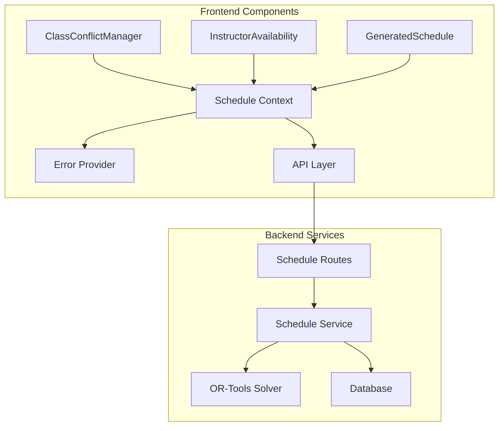
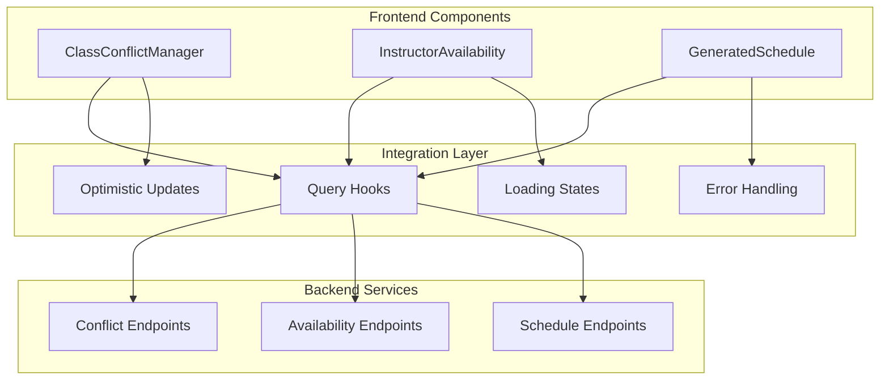
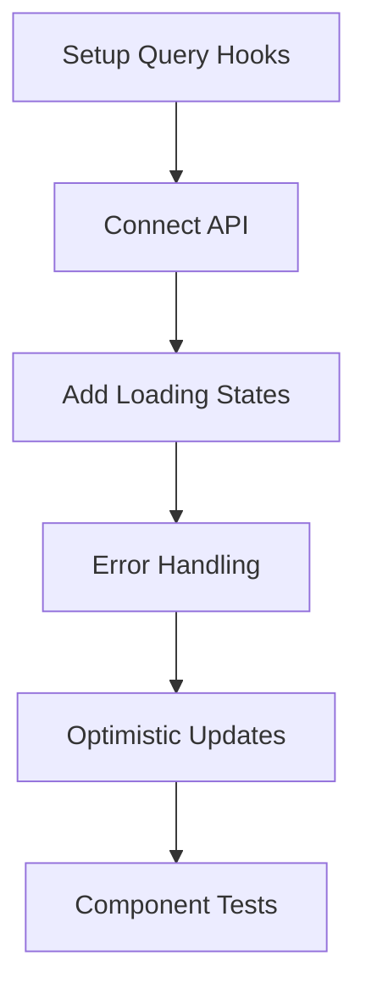
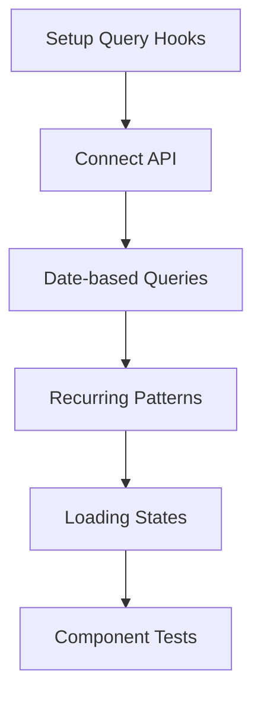
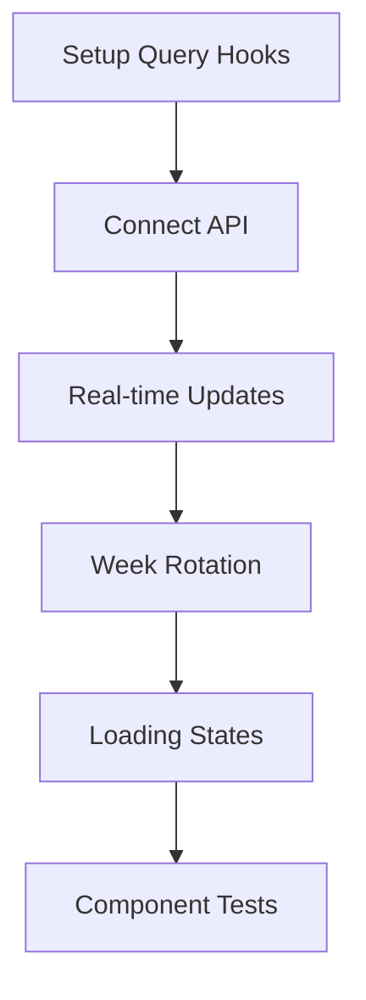
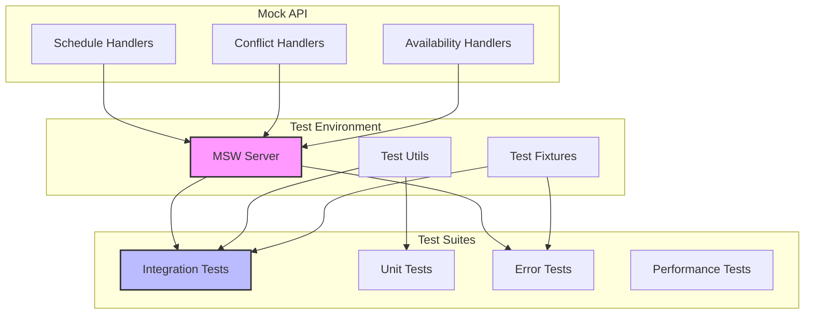

# Thunder Scheduler: Initial Integration Plan

## Overview

This document outlines the plan for Phase 1, Step 8: Initial Integration, focusing on connecting the frontend visualization components with backend services, implementing error handling, and adding integration tests.

## Architecture Overview



## Implementation Plan

### 1. Error Handling Infrastructure

```typescript
// Error types aligned with backend
interface ApiError {
  code: string;
  message: string;
  details?: Record<string, any>;
}

// Error codes mapping
const ERROR_CODES = {
  SCHEDULE_NOT_FOUND: 'Schedule not found',
  CONSTRAINT_VIOLATION: 'Schedule violates constraints',
  SOLVER_ERROR: 'Failed to generate schedule',
  VALIDATION_ERROR: 'Invalid input data',
  NETWORK_ERROR: 'Network connection issue',
  UNKNOWN_ERROR: 'An unexpected error occurred'
} as const;

// Error boundary component for schedule-related errors
class ScheduleErrorBoundary extends React.Component {
  // Implementation details...
}

// Error context for global error state management
const ErrorContext = createContext<ErrorContextType>(null);
```

### 2. API Integration

#### 2.1 Component Integration Overview


#### 2.2 ClassConflictManager Integration


```typescript
const useConflictManager = (classId: string) => {
  const queryClient = useQueryClient();
  
  return useMutation({
    mutationFn: (conflicts: DailyConflicts[]) =>
      scheduleService.updateConflicts(classId, conflicts),
    onError: (error: ApiError) => {
      handleScheduleError(error);
    },
    onSettled: () => {
      queryClient.invalidateQueries(['conflicts', classId]);
    }
  });
};
```

Implementation steps:
- Connect to conflict management endpoints
- Handle optimistic updates
- Implement error states
- Add loading indicators
- Integrate with ScheduleContext

#### 2.3 InstructorAvailability Integration


```typescript
const useTeacherAvailability = (date: Date) => {
  return useQuery({
    queryKey: ['availability', date.toISOString()],
    queryFn: () => scheduleService.getAvailability(date),
    onError: (error: ApiError) => {
      handleScheduleError(error);
    }
  });
};
```

Implementation steps:
- Connect to teacher availability API
- Implement date-based queries
- Handle recurring availability patterns
- Add error handling
- Integrate with date navigation

#### 2.4 GeneratedSchedule Integration


Implementation steps:
- Connect to schedule generation API
- Implement real-time updates
- Add loading states
- Handle complex error scenarios
- Support week rotation

### 3. Testing Infrastructure

#### 3.1 Testing Architecture Overview


#### 3.2 MSW Setup and Configuration
```typescript
// src/test/handlers/schedule.ts
import { rest } from 'msw';
import { mockSchedule, mockConflicts, mockAvailability } from '../fixtures';

export const scheduleHandlers = [
  // Schedule endpoints
  rest.get('/api/schedule/:id', (req, res, ctx) => {
    const { id } = req.params;
    return res(ctx.json(mockSchedule(id)));
  }),
  rest.post('/api/schedule/generate', (req, res, ctx) => {
    return res(ctx.json(mockSchedule('new')));
  }),

  // Conflict management endpoints
  rest.get('/api/conflicts/:classId', (req, res, ctx) => {
    const { classId } = req.params;
    return res(ctx.json(mockConflicts(classId)));
  }),
  rest.put('/api/conflicts/:classId', (req, res, ctx) => {
    return res(ctx.status(200));
  }),

  // Availability endpoints
  rest.get('/api/availability/:date', (req, res, ctx) => {
    const { date } = req.params;
    return res(ctx.json(mockAvailability(date)));
  }),
  rest.put('/api/availability', (req, res, ctx) => {
    return res(ctx.status(200));
  })
];

// src/test/server.ts
import { setupServer } from 'msw/node';
import { scheduleHandlers } from './handlers/schedule';

export const server = setupServer(...scheduleHandlers);

// src/test/fixtures/index.ts
export const mockSchedule = (id: string) => ({
  id,
  classes: [],
  conflicts: [],
  generated: true
});

export const mockConflicts = (classId: string) => ({
  classId,
  conflicts: []
});

export const mockAvailability = (date: string) => ({
  date,
  slots: []
});

// src/test/utils/test-utils.tsx
import { render } from '@testing-library/react';
import { ErrorProvider } from '../../context/error/ErrorContext';
import { QueryProvider } from '../../context/QueryProvider';

export const renderWithProviders = (ui: React.ReactElement) => {
  return render(
    <ErrorProvider>
      <QueryProvider>
        {ui}
      </QueryProvider>
    </ErrorProvider>
  );
};
```

#### 3.3 Component Integration Tests
```typescript
import { server } from '../test/server';
import { renderWithProviders } from '../test/utils/test-utils';
import { mockSchedule } from '../test/fixtures';

describe('Schedule Integration', () => {
  beforeAll(() => server.listen());
  afterEach(() => server.resetHandlers());
  afterAll(() => server.close());

  describe('ClassConflictManager', () => {
    it('handles conflict updates', async () => {
      renderWithProviders(<ClassConflictManager classId="123" />);
      await waitFor(() => {
        expect(screen.getByTestId('conflict-grid')).toBeInTheDocument();
      });
      // Additional assertions...
    });

    it('displays error state on API failure', async () => {
      server.use(
        rest.get('/api/conflicts/:classId', (req, res, ctx) => {
          return res(ctx.status(500));
        })
      );
      renderWithProviders(<ClassConflictManager classId="123" />);
      await waitFor(() => {
        expect(screen.getByText(/error/i)).toBeInTheDocument();
      });
    });
  });

  // Similar test structure for InstructorAvailability and GeneratedSchedule
});
```

### 4. Performance Optimizations

1. Query Caching
```typescript
const queryClient = new QueryClient({
  defaultOptions: {
    queries: {
      staleTime: 5 * 60 * 1000, // 5 minutes
      cacheTime: 30 * 60 * 1000, // 30 minutes
      retry: 2,
      refetchOnWindowFocus: false
    }
  }
});
```

2. Optimistic Updates
```typescript
const useUpdateSchedule = () => {
  return useMutation({
    mutationFn: updateSchedule,
    onMutate: async (newSchedule) => {
      await queryClient.cancelQueries(['schedule']);
      const previousSchedule = queryClient.getQueryData(['schedule']);
      queryClient.setQueryData(['schedule'], newSchedule);
      return { previousSchedule };
    },
    onError: (err, newSchedule, context) => {
      queryClient.setQueryData(['schedule'], context.previousSchedule);
    }
  });
};
```

## Implementation Timeline

### Day 1: Error Handling Infrastructure
- [ ] Implement Error Provider
- [ ] Create Error Boundary components
- [ ] Add error utilities
- [ ] Setup error reporting

### Day 2: API Integration
- [ ] Integrate ClassConflictManager
- [ ] Integrate InstructorAvailability
- [ ] Integrate GeneratedSchedule
- [ ] Add loading states

### Day 3: Testing
- [ ] Setup MSW test server
- [ ] Add integration tests
- [ ] Test error scenarios
- [ ] Add performance monitoring

## Success Criteria

1. All components successfully integrated with backend
2. Comprehensive error handling implemented
3. Integration tests passing
4. Error boundaries catching and displaying errors properly
5. Loading states working correctly
6. Optimistic updates functioning
7. Performance metrics within acceptable ranges

## Next Steps

After completing this integration phase:
1. Begin Phase 2: Enhanced UI and Manual Adjustments
2. Focus on FullCalendar integration
3. Implement drag-and-drop functionality
4. Add teacher availability calendar enhancements

## Progress Tracking

### Error Handling Infrastructure
- [x] Implement Error Provider (ErrorContext.tsx)
- [x] Create Error Boundary components (ScheduleErrorBoundary.tsx)
- [x] Add error utilities (types.ts, handlers.ts)
- [x] Create error hooks (useErrorHandler.ts)
- [ ] Setup error reporting and monitoring

### API Integration
#### ClassConflictManager
- [x] Create container component with mock service
- [x] Implement loading states
- [x] Implement error handling
- [x] Add optimistic updates
- [ ] Connect to real backend API endpoints

#### InstructorAvailability
- [x] Create container component with mock service
- [x] Implement date-based queries
- [x] Add loading states
- [x] Add error handling
- [x] Integrate with date navigation
- [ ] Connect to real backend API endpoints

#### GeneratedSchedule
- [x] Create container component with mock service
- [x] Implement loading states
- [x] Add error handling
- [x] Support week rotation
- [ ] Connect to real backend API endpoints

### Testing Infrastructure
- [x] Set up test environment
- [x] Create example component tests
- [x] Setup MSW test server
- [x] Add handlers for all endpoints
- [x] Create test fixtures
- [x] Add example integration test
- [x] Add integration tests for ClassConflictManager with mock services
- [x] Add integration tests for InstructorAvailability with mock services
- [x] Add integration tests for GeneratedSchedule with mock services
- [ ] Test with real backend APIs
- [ ] Test error scenarios with real APIs
- [ ] Add performance monitoring

### Performance Optimizations
- [x] Configure React Query defaults
- [x] Implement optimistic updates pattern
- [ ] Add caching for main components
- [ ] Implement performance metrics
- [ ] Add load time monitoring

### Documentation
- [x] Document error handling approach
- [x] Create example usage components
- [ ] Document API integration patterns
- [ ] Add performance guidelines
- [ ] Create migration guide

## Current Status
As of March 18, 2025:
- Completed basic error handling infrastructure
- Set up React Query with proper configuration
- Created container components with mock services for all three visualization components
- Implemented loading states and error handling in all container components
- Added optimistic updates for mutations
- Created integration tests with mock services for all components
- Implemented MSW setup for API mocking in tests
- **COMPLETED**: Container components with mock services
- **NEXT**: Replace mock services with real API implementations

## Revised Timeline
1. Week 1 (Completed)
   - Set up MSW and testing infrastructure
   - Create container components with mock services
   - Add integration tests with mock services

2. Week 2 (Current)
   - Replace mock services with real API implementations
   - Update App.tsx to use container components
   - Test with real backend APIs

3. Week 3
   - Implement performance monitoring
   - Add additional tests for edge cases
   - Document all integrations
   - Prepare for Phase 2

## Implementation Details

### File Structure
```
frontend/src/
├── components/
│   ├── shared/
│   │   ├── LoadingSpinner.tsx
│   │   └── ScheduleErrorBoundary.tsx
│   └── schedule/
│       └── examples/
│           └── ScheduleExample.tsx
├── context/
│   ├── QueryProvider.tsx
│   └── error/
│       └── ErrorContext.tsx
├── hooks/
│   ├── useErrorHandler.ts
│   └── useScheduleQuery.ts
├── test/
│   ├── fixtures/
│   │   └── index.ts
│   ├── handlers/
│   │   └── schedule.ts
│   ├── server.ts
│   └── test-utils.tsx
└── utils/
    └── error/
        ├── handlers.ts
        └── types.ts
```

### Usage Example
```typescript
const MyComponent = ({ scheduleId }) => {
  const { data, isLoading } = useSchedule(scheduleId);
  const updateMutation = useUpdateSchedule(scheduleId);

  if (isLoading) return <LoadingSpinner />;

  return (
    <ScheduleErrorBoundary>
      {/* Component content */}
    </ScheduleErrorBoundary>
  );
};
```

### Migration Guide
1. Wrap application with providers:
   ```tsx
   <ErrorProvider>
     <QueryProvider>
       <App />
     </QueryProvider>
   </ErrorProvider>
   ```

2. Replace direct API calls with hooks:
   ```typescript
   // Before
   const response = await api.get('/schedule/${id}');

   // After
   const { data } = useSchedule(id);
   ```

3. Add error boundaries:
   ```tsx
   <ScheduleErrorBoundary>
     <YourComponent />
   </ScheduleErrorBoundary>
   ```

4. Handle mutations:
   ```typescript
   const mutation = useUpdateSchedule(id);
   await mutation.mutateAsync(updates);
   ```

### Best Practices
1. Always use error boundaries for schedule components
2. Implement proper loading states
3. Use optimistic updates for better UX
4. Handle error recovery gracefully
5. Test error scenarios thoroughly