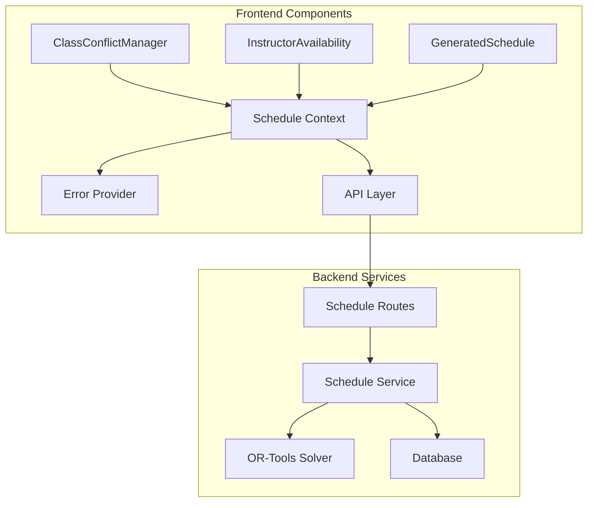

# Thunder Scheduler: Initial Integration Plan

## Overview

This document outlines the plan for Phase 1, Step 8: Initial Integration, focusing on connecting the frontend visualization components with backend services, implementing error handling, and adding integration tests.

## Architecture Overview



## Implementation Plan

### 1. Error Handling Infrastructure

```typescript
// Error types aligned with backend
interface ApiError {
  code: string;
  message: string;
  details?: Record<string, any>;
}

// Error codes mapping
const ERROR_CODES = {
  SCHEDULE_NOT_FOUND: 'Schedule not found',
  CONSTRAINT_VIOLATION: 'Schedule violates constraints',
  SOLVER_ERROR: 'Failed to generate schedule',
  VALIDATION_ERROR: 'Invalid input data',
  NETWORK_ERROR: 'Network connection issue',
  UNKNOWN_ERROR: 'An unexpected error occurred'
} as const;

// Error boundary component for schedule-related errors
class ScheduleErrorBoundary extends React.Component {
  // Implementation details...
}

// Error context for global error state management
const ErrorContext = createContext<ErrorContextType>(null);
```

### 2. API Integration

#### 2.1 ClassConflictManager Integration
- Connect to conflict management endpoints
- Handle optimistic updates
- Implement error states
- Add loading indicators
- Integrate with ScheduleContext

```typescript
const useConflictManager = (classId: string) => {
  const queryClient = useQueryClient();
  
  return useMutation({
    mutationFn: (conflicts: DailyConflicts[]) => 
      scheduleService.updateConflicts(classId, conflicts),
    onError: (error: ApiError) => {
      handleScheduleError(error);
    },
    onSettled: () => {
      queryClient.invalidateQueries(['conflicts', classId]);
    }
  });
};
```

#### 2.2 InstructorAvailability Integration
- Connect to teacher availability API
- Implement date-based queries
- Handle recurring availability patterns
- Add error handling
- Integrate with date navigation

```typescript
const useTeacherAvailability = (date: Date) => {
  return useQuery({
    queryKey: ['availability', date.toISOString()],
    queryFn: () => scheduleService.getAvailability(date),
    onError: (error: ApiError) => {
      handleScheduleError(error);
    }
  });
};
```

#### 2.3 GeneratedSchedule Integration
- Connect to schedule generation API
- Implement real-time updates
- Add loading states
- Handle complex error scenarios
- Support week rotation

### 3. Testing Infrastructure

#### 3.1 Integration Test Setup
```typescript
// Mock server setup
import { setupServer } from 'msw/node';
import { rest } from 'msw';

const handlers = [
  rest.get('/api/schedule/:id', (req, res, ctx) => {
    return res(ctx.json(mockSchedule));
  }),
  // Additional handlers...
];

const server = setupServer(...handlers);
```

#### 3.2 Component Integration Tests
```typescript
describe('Schedule Integration', () => {
  // ClassConflictManager tests
  it('handles conflict updates', async () => {
    render(<ClassConflictManager classId="123" />);
    // Test implementation...
  });

  // InstructorAvailability tests
  it('displays teacher availability', async () => {
    render(<InstructorAvailability />);
    // Test implementation...
  });

  // GeneratedSchedule tests
  it('displays generated schedule', async () => {
    render(<GeneratedSchedule />);
    // Test implementation...
  });
});
```

### 4. Performance Optimizations

1. Query Caching
```typescript
const queryClient = new QueryClient({
  defaultOptions: {
    queries: {
      staleTime: 5 * 60 * 1000, // 5 minutes
      cacheTime: 30 * 60 * 1000, // 30 minutes
      retry: 2,
      refetchOnWindowFocus: false
    }
  }
});
```

2. Optimistic Updates
```typescript
const useUpdateSchedule = () => {
  return useMutation({
    mutationFn: updateSchedule,
    onMutate: async (newSchedule) => {
      await queryClient.cancelQueries(['schedule']);
      const previousSchedule = queryClient.getQueryData(['schedule']);
      queryClient.setQueryData(['schedule'], newSchedule);
      return { previousSchedule };
    },
    onError: (err, newSchedule, context) => {
      queryClient.setQueryData(['schedule'], context.previousSchedule);
    }
  });
};
```

## Implementation Timeline

### Day 1: Error Handling Infrastructure
- [ ] Implement Error Provider
- [ ] Create Error Boundary components
- [ ] Add error utilities
- [ ] Setup error reporting

### Day 2: API Integration
- [ ] Integrate ClassConflictManager
- [ ] Integrate InstructorAvailability
- [ ] Integrate GeneratedSchedule
- [ ] Add loading states

### Day 3: Testing
- [ ] Setup MSW test server
- [ ] Add integration tests
- [ ] Test error scenarios
- [ ] Add performance monitoring

## Success Criteria

1. All components successfully integrated with backend
2. Comprehensive error handling implemented
3. Integration tests passing
4. Error boundaries catching and displaying errors properly
5. Loading states working correctly
6. Optimistic updates functioning
7. Performance metrics within acceptable ranges

## Next Steps

After completing this integration phase:
1. Begin Phase 2: Enhanced UI and Manual Adjustments
2. Focus on FullCalendar integration
3. Implement drag-and-drop functionality
4. Add teacher availability calendar enhancements

## Progress Tracking

### Error Handling Infrastructure
- [x] Implement Error Provider (ErrorContext.tsx)
- [x] Create Error Boundary components (ScheduleErrorBoundary.tsx)
- [x] Add error utilities (types.ts, handlers.ts)
- [x] Create error hooks (useErrorHandler.ts)
- [ ] Setup error reporting and monitoring

### API Integration
#### ClassConflictManager
- [ ] Connect to conflict management endpoints
- [ ] Handle optimistic updates
- [ ] Implement error states
- [ ] Add loading indicators
- [ ] Integrate with ScheduleContext

#### InstructorAvailability
- [ ] Connect to teacher availability API
- [ ] Implement date-based queries
- [ ] Handle recurring availability patterns
- [ ] Add error handling
- [ ] Integrate with date navigation

#### GeneratedSchedule
- [ ] Connect to schedule generation API
- [ ] Implement real-time updates
- [ ] Add loading states
- [ ] Handle complex error scenarios
- [ ] Support week rotation

### Testing Infrastructure
- [x] Set up test environment
- [x] Create example component tests
- [ ] Setup MSW test server
- [ ] Add handlers for all endpoints
- [ ] Add integration tests for ClassConflictManager
- [ ] Add integration tests for InstructorAvailability
- [ ] Add integration tests for GeneratedSchedule
- [ ] Test error scenarios
- [ ] Add performance monitoring

### Performance Optimizations
- [x] Configure React Query defaults
- [x] Implement optimistic updates pattern
- [ ] Add caching for main components
- [ ] Implement performance metrics
- [ ] Add load time monitoring

### Documentation
- [x] Document error handling approach
- [x] Create example usage components
- [ ] Document API integration patterns
- [ ] Add performance guidelines
- [ ] Create migration guide

## Current Status
As of March 17, 2025:
- Completed basic error handling infrastructure
- Set up React Query with proper configuration
- Created example components and tests
- **BLOCKED**: Main component integration pending
- **NEEDED**: MSW setup for testing
- **NEXT**: Begin ClassConflictManager integration

## Revised Timeline
1. Week 1 (Current)
   - Complete ClassConflictManager integration
   - Set up MSW and testing infrastructure
   - Add first round of integration tests

2. Week 2
   - Complete InstructorAvailability integration
   - Add corresponding integration tests
   - Implement performance monitoring

3. Week 3
   - Complete GeneratedSchedule integration
   - Finish remaining tests
   - Document all integrations

## Implementation Details

### File Structure
```
frontend/src/
├── components/
│   ├── shared/
│   │   ├── LoadingSpinner.tsx
│   │   └── ScheduleErrorBoundary.tsx
│   └── schedule/
│       └── examples/
│           └── ScheduleExample.tsx
├── context/
│   ├── QueryProvider.tsx
│   └── error/
│       └── ErrorContext.tsx
├── hooks/
│   ├── useErrorHandler.ts
│   └── useScheduleQuery.ts
└── utils/
    └── error/
        ├── handlers.ts
        └── types.ts
```

### Usage Example
```typescript
const MyComponent = ({ scheduleId }) => {
  const { data, isLoading } = useSchedule(scheduleId);
  const updateMutation = useUpdateSchedule(scheduleId);

  if (isLoading) return <LoadingSpinner />;

  return (
    <ScheduleErrorBoundary>
      {/* Component content */}
    </ScheduleErrorBoundary>
  );
};
```

### Migration Guide
1. Wrap application with providers:
   ```tsx
   <ErrorProvider>
     <QueryProvider>
       <App />
     </QueryProvider>
   </ErrorProvider>
   ```

2. Replace direct API calls with hooks:
   ```typescript
   // Before
   const response = await api.get('/schedule/${id}');

   // After
   const { data } = useSchedule(id);
   ```

3. Add error boundaries:
   ```tsx
   <ScheduleErrorBoundary>
     <YourComponent />
   </ScheduleErrorBoundary>
   ```

4. Handle mutations:
   ```typescript
   const mutation = useUpdateSchedule(id);
   await mutation.mutateAsync(updates);
   ```

### Best Practices
1. Always use error boundaries for schedule components
2. Implement proper loading states
3. Use optimistic updates for better UX
4. Handle error recovery gracefully
5. Test error scenarios thoroughly